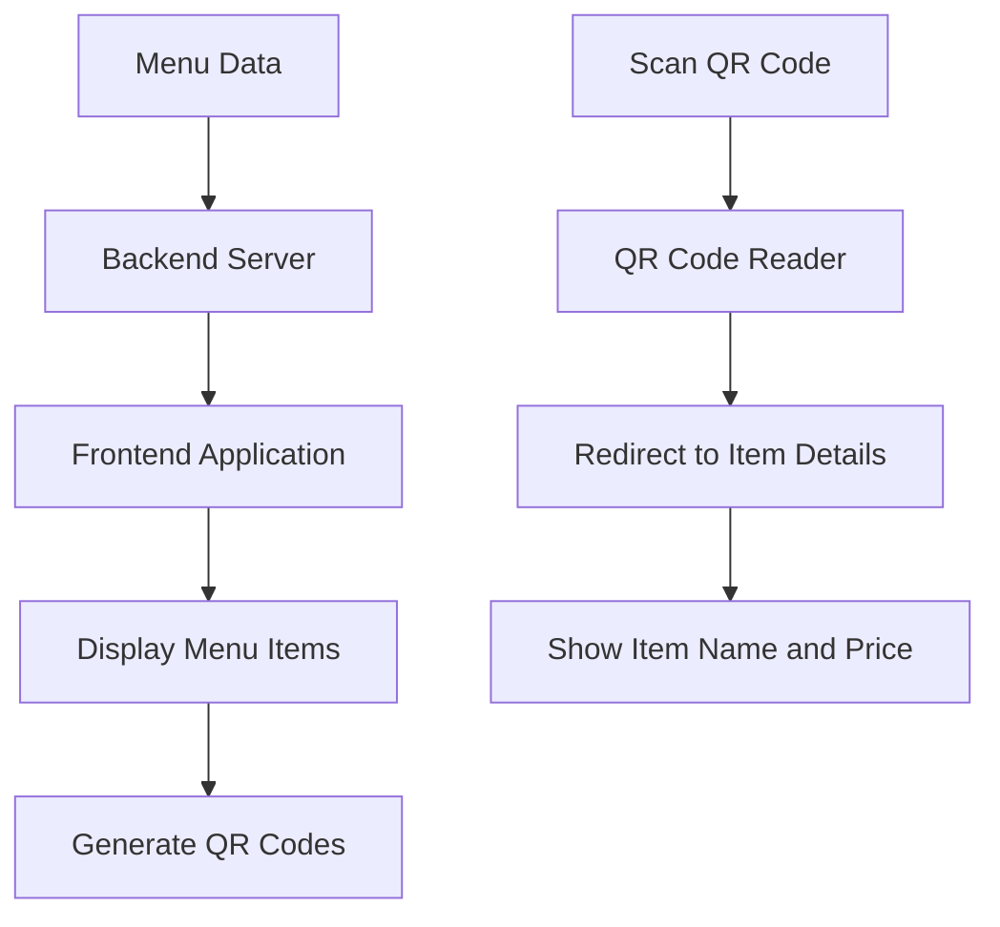

# Simple Restaurant Menu Design

## 1. Overview

This document outlines the design for a simple restaurant menu application that displays food items with their prices and pictures. Each menu item will have a QR code that, when scanned, will display the name and price of the food item.

### Key Features

- Display menu items with images, names, and prices
- Generate scannable QR codes for each menu item
- Mobile-responsive design for easy viewing on any device
- Simple and intuitive user interface

## 2. Technology Stack

- **Frontend**: HTML, CSS, JavaScript (with potential to use React or Vue.js for enhanced functionality)
- **QR Code Generation**: JavaScript library such as qrcode.js or similar
- **Backend**: Node.js with Express (for handling menu data and QR code generation)
- **Database**: JSON file or MongoDB for storing menu item data
- **Deployment**: Can be deployed as a static website or web application

## 3. Data Model

### Menu Item

| Field       | Type   | Description                         |
| ----------- | ------ | ----------------------------------- |
| id          | String | Unique identifier for the menu item |
| name        | String | Name of the food item               |
| description | String | Description of the food item        |
| price       | Number | Price of the food item              |
| image       | String | URL or path to the food image       |
| qrCode      | String | Generated QR code data              |

## 4. Component Architecture

### 4.1 Menu Display Component

- Renders all menu items in a grid or list layout
- Each item displays:
  - Food image
  - Item name
  - Price
  - QR code

### 4.2 QR Code Component

- Generates QR code for each menu item
- Encodes item information (name and price)
- Displays scannable QR code

### 4.3 Menu Item Detail Component

- Shows detailed information when QR code is scanned
- Displays item name and price

## 5. User Interface Design

### 5.1 Main Menu Page

```
+-----------------------------------------------------+
|                Restaurant Name                      |
+-----------------------------------------------------+
|  [Image]        [Image]        [Image]              |
|  Pizza          Burger         Salad                |
|  $12.99         $9.99          $7.99                |
|  [QR Code]      [QR Code]      [QR Code]            |
|                                                     |
|  [Image]        [Image]        [Image]              |
|  Pasta          Steak          Soup                 |
|  $14.99         $18.99         $6.99                |
|  [QR Code]      [QR Code]      [QR Code]            |
+-----------------------------------------------------+
```

### 5.2 QR Code Scan Result Page

```
+-----------------------------------------------------+
|                Item Details                         |
+-----------------------------------------------------+
|  Item Name: Pizza                                   |
|  Price: $12.99                                      |
+-----------------------------------------------------+
```

## 6. QR Code Functionality

### 6.1 QR Code Generation

- Each menu item will have a unique QR code
- QR code will encode a URL pointing to the item details
- URL format: `https://restaurant.com/item/{itemId}`

### 6.2 QR Code Content

When scanned, the QR code will lead to a page displaying:

- Item name
- Item price

## 7. API Endpoints

### 7.1 Get All Menu Items

```
GET /api/menu
Response:
[
  {
    "id": "1",
    "name": "Pizza",
    "description": "Delicious cheese pizza",
    "price": 12.99,
    "image": "/images/pizza.jpg"
  },
  {
    "id": "2",
    "name": "Burger",
    "description": "Juicy beef burger",
    "price": 9.99,
    "image": "/images/burger.jpg"
  }
]
```

### 7.2 Get Menu Item by ID

```
GET /api/menu/{id}
Response:
{
  "id": "1",
  "name": "Pizza",
  "description": "Delicious cheese pizza",
  "price": 12.99,
  "image": "/images/pizza.jpg"
}
```

## 8. Data Flow



## 9. Implementation Plan

### Phase 1: Basic Menu Display

- Create data structure for menu items
- Implement basic frontend to display menu items
- Add images and pricing information

### Phase 2: QR Code Integration

- Integrate QR code generation library
- Generate QR codes for each menu item
- Create QR code display functionality

### Phase 3: QR Code Scanning Functionality

- Create item detail page
- Implement URL routing for QR codes
- Test scanning functionality

## 10. Version Control

### 10.1 Repository Structure

- Initialize a Git repository for version control
- Create appropriate branch structure (main for production, develop for development)
- Set up .gitignore file to exclude unnecessary files (node_modules, build artifacts, etc.)

### 10.2 Commit Guidelines

- Follow conventional commit messages (feat:, fix:, chore:, etc.)
- Commit frequently with descriptive messages
- Create tags for releases

## 11. Testing Strategy

### 11.1 Unit Tests

- Test menu item data structure
- Test QR code generation functions
- Test API endpoints

### 11.2 Integration Tests

- Test data flow from backend to frontend
- Test QR code generation and scanning workflow

### 11.3 User Acceptance Tests

- Verify menu items display correctly
- Test QR code scanning on multiple devices
- Confirm correct item details are shown after scanning